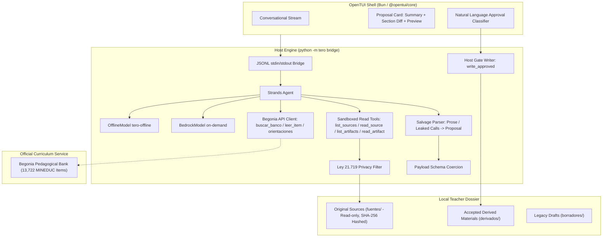

# Architecture — tero

tero is a **conversational Strands agent** paired with an **OpenTUI** shell. The
agent understands the user's message and acts upon their intent:
- **a) Answer / interact:** pedagogical queries, curriculum questions, and local source inspection without creating files.
- **b) Create new material:** grounded lesson plans, reading guides, quizzes, rubrics, and activities.
- **c) Edit or adapt existing material:** iterative modifications, alternate versions ("Fila B"), and special education (NEE) accommodations under Chile's **Decreto 83/2015**.

The agent operates strictly in memory: **the language model never writes files to disk**. The only write destination is `derivados/`, which is written exclusively by host-side code upon explicit human conversational approval. Original classroom sources in `fuentes/` are hashed with SHA-256 and are read-only. `borradores/` is a legacy directory: existing files can be read, edited, or adapted, but no new files are placed there without approval.

The public face of the repo is the **OpenTUI of tero**, virtualized in
one window — not a splash wave, not a SaaS page. Photocopied paper is
only for pages tero creates:
[site/](site/) → <https://marcorojasb.github.io/tero/>.

---

## Thesis

> *your sources, your judgment — the agent proposes, the educator decides*

The teacher's local folder is the system of record. Tools only read. There is
no rigid step-by-step wizard: no home rumbos menu, no typed plan with approve/cancel keys, no numbered clarification questions, and no `s` / `n` / `b` / `c` gate. If information is missing, the agent **asks in natural language**. Before writing, it presents **what it will do + a structured preview** and waits for approval. Warnings never block approval. See [docs/PUERTA-Y-PR8.md](docs/PUERTA-Y-PR8.md).

---

## Component Topology

---

## Conversational Execution Loop

1. **Teacher Prompt:** The educator enters a natural-language message. The agent infers the intent:
   - **a)** Answer / interact.
   - **b)** Create new material (`proponer_crear`).
   - **c)** Edit or adapt existing material (`proponer_editar`), including Decreto 83 NEE accommodations.
2. **Clarification:** If essential context is missing (grade level, specific topic, target file to adapt), the agent **asks conversationally** rather than hallucinating defaults.
3. **Inspection & Begonia Grounding:** The agent reads only inside the sandboxed dossier (with Ley 21.719 excluding sensitive health/grade records) and queries the official MINEDUC pedagogical bank (`begonia`) for matching items and teaching guidances.
4. **In-Memory Proposal:** The agent prepares the artifact in memory with verifiable citations (`fuentes/...` or `banco:<id>`). Tool usage is capped by host-side budgets (`DRAFT_TOOL_BUDGET`), with one activity event emitted per tool call.
5. **Non-Blocking Warnings:** The host evaluates alignment, catalog coverage, and evidence density. For NEE adaptations, it attaches the non-blocking `paci_no_oficial` advisory.
6. **Conversational Approval:** The teacher reviews the staged summary and Markdown preview, answering naturally (*"dale"*, *"me parece bien"*, *"sí"*, or key **`y`**).
7. **Host-Side Emission:** The host writes the approved Markdown into `derivados/`. If adapting or creating a Fila B, a **new** file is created referencing `origen: ...`, leaving the base file untouched.
8. **Integrity Re-hash:** Original sources are re-hashed to verify zero unauthorized modification.

---

## Trust Boundaries and Invariants

| Action | Agent Capability | Host Enforcement Mechanism |
| :--- | :---: | :--- |
| **Read outside dossier** | **Forbidden** | `Workspace._safe_join()` raises `WorkspaceError` on path traversal or symlink escapes. |
| **Overwrite original sources** | **Forbidden** | `Workspace.is_write_allowed()` raises `WriteGuardError` if target is inside `fuentes/`. |
| **Direct LLM file writes** | **Forbidden** | Tool registry provides zero write primitives. Writing occurs exclusively in `tero.gate.write_approved()`. |
| **Exposure of student health data** | **Prevented** | `Workspace._iter_source_files()` filters out files matching health/grade criteria under **Ley 21.719**. |
| **Fabricated Bedrock offline calls** | **Prevented** | `tero-offline` is an explicit, scripted `strands.models.Model` labeled honestly as `tero-offline`. |
| **Unverified citations** | **Audited** | Host verifies snippets against local files or active `banco_ids`; unverified quotes receive the `?` badge and warning. |
| **Blocking teacher decisions** | **Forbidden** | Heuristics and quality checks inform the educator of trade-offs but never prevent the teacher from approving. |

---

## Deployment Models & Empirically Benchmarked Trio

Following empirical benchmarking across 5 foundation models on Amazon Bedrock (see [docs/EVALUATION-PAPER.md](docs/EVALUATION-PAPER.md)), tero recommends three models:
1. **`amazon.nova-lite-v1:0` (Default):** Native serverless AWS Bedrock execution, ultra-low cost (~$0.06/1M input tokens), 100% benchmark completion rate, high Begonia citation density.
2. **`zai.glm-4.7-flash`:** High-speed operational engine (sub-10s latency), exact Decreto 83 NEE structured schema adherence.
3. **`minimax.minimax-m2.5`:** Highest-quality classroom literary prose and granular assessment rubrics in authentic Chilean Spanish.
