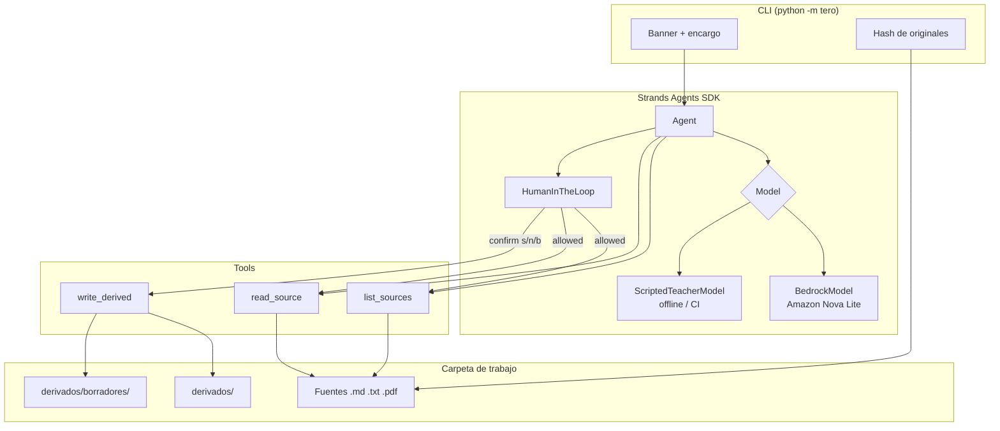

# Architecture — tero

tero is a **single Strands agent** with three tools and one human gate. There is no desktop shell, no background daemon, and no write path except `derivados/`.

## Thesis

> your sources, your judgment / agent prepares, teacher decides

The teacher’s folder is the system of record. The agent is a preparer. The write tool is not allowed to run until a human answers.

## Components



## Agent loop

1. The CLI builds a `Workspace` rooted at the teacher folder.
2. `build_agent` registers `list_sources`, `read_source`, `write_derived`.
3. `HumanInTheLoop` allow-lists the two read tools. `write_derived` always asks.
4. The model (Bedrock or scripted) must **list → read → write**. The system prompt forbids inventing OA codes that are not in the sources.
5. The custom `ask` callback prints the Markdown proposal and waits for `s` / `n` / `b`.
   - **s:** tool runs; file lands in `derivados/`.
   - **n:** tool is denied; proposal discarded.
   - **b:** tool runs with `workspace.as_draft = True`; file lands in `derivados/borradores/`.
6. After the run, the CLI re-hashes originals. A mismatch exits non-zero.

## Why Strands + Bedrock

- **Strands** owns the tool loop and the official HITL intervention (`strands.vended_interventions.hitl.HumanInTheLoop`). tero does not reimplement an agent runtime.
- **Bedrock** is the production model provider. The id is `TERO_MODEL_ID` (default `amazon.nova-lite-v1:0` in `us-east-1`) so judges can switch to Nova Micro or Claude without code changes.
- **ScriptedTeacherModel** is a Strands `Model` that emits the same tool-call stream events, so CI and `--offline` still exercise tools + HITL. It is not a second product path; it is the same agent with a stand-in model.

## Trust boundaries

| Can the agent… | |
| --- | --- |
| Read files outside the work folder | No (`Path.resolve` + `relative_to`) |
| Read `derivados/` as a “source” | No |
| Write a non-`.md` name, or a path with `..` | No |
| Write without at least one citation that exists as an original | No |
| Overwrite an original | No — writes only under `derivados/` |

## Offline vs Bedrock

Both modes construct `strands.Agent(...)`. The only swap is `model=`.

```text
tero demo --yes              → BedrockModel(TERO_MODEL_ID)
tero demo --offline --yes    → ScriptedTeacherModel()
```
