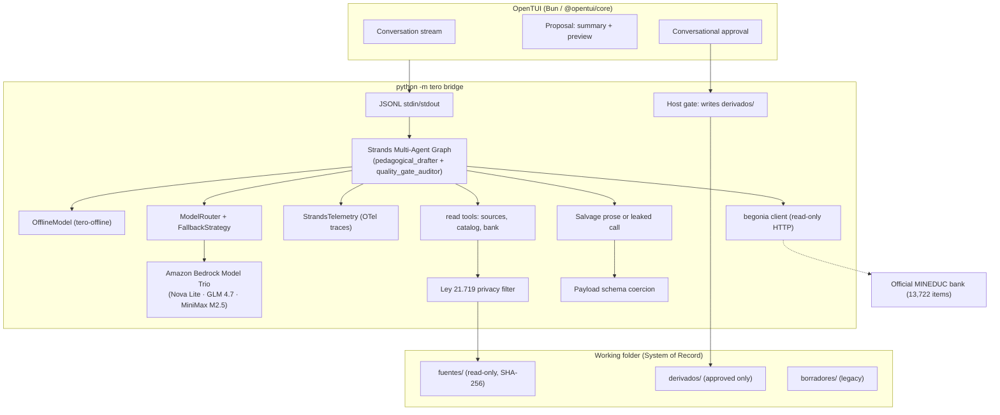

# Architecture — tero

A **Strands Agents** conversational agent plus an **OpenTUI** shell. The agent
proposes in memory; the host writes only after the teacher approves.

The public face of the repo is the **OpenTUI of tero**, virtualized in one window —
not a splash wave, not a SaaS page. Photocopied paper is only for pages tero creates:
[site/](site/) → <https://marcorojasb.github.io/tero/>.

## Topology

## Turn

1. The teacher writes in Spanish. The agent infers the intent: **a)** answer,
   **b)** create, **c)** edit or adapt (including NEE).
2. Missing context is asked in natural language — no wizard, no numbered options.
3. The agent reads only inside the folder (path sandbox, hash index, privacy
   filter) and consults the official curriculum bank.
4. **Strands Multi-Agent Graph** orchestrates the generation:
   - `pedagogical_drafter`: reads evidence and composes the in-memory proposal.
   - `quality_gate_auditor`: validates curriculum alignment and Decreto 83 NEE accommodations.
   - Cycle limits prevent infinite refinement loops.
5. All operations emit structured OpenTelemetry traces via **`StrandsTelemetry`**.
6. Non-blocking warnings are attached (`thin_evidence`, `unverified_citation`,
   `paci_no_oficial`).
7. The teacher approves conversationally. The **host** writes `derivados/`.
   Adapting creates a new file with `origen:`; the base is untouched.
8. Originals are re-hashed. A change is a warning, never a rewrite.

## Trust boundaries

| Action | Capability | Enforcement |
| --- | :---: | :--- |
| Read outside the folder | No | `Workspace._safe_join` + `WriteGuardError` |
| Overwrite originals | No | writes restricted to `derivados/` |
| Model writes files | No | no write tool exists; only `tero.gate.write_approved` writes |
| Sensitive student data to the model | No | `tero.privacy` admission filter (Ley 21.719) |
| Fabricated Bedrock in `--offline` | No | `tero-offline` is a real scripted Strands `Model` |
| Unverified citation | Marked | host checks the file or the bank; `?` badge + warning |
| Block the teacher's decision | No | warnings inform; approval stays human |
| Infinite multi-agent cycles | No | `max_cycles=3` strictly enforced by `StrandsMultiAgentGraph` |

## Stack

Python 3.11+ (`src/tero`), Strands Agents, Amazon Bedrock, OpenTUI/Bun (`tui/`),
LaTeX templates (`templates/latex/`). Protocol: [docs/CONVERSACIONAL.md](docs/CONVERSACIONAL.md).
Models and measurements: [docs/EVALUATION-PAPER.md](docs/EVALUATION-PAPER.md).

## Verification

- **Python test suite:** 390 passed, 1 skipped, 0 xfailed (`uv run pytest`)
- **OpenTUI shell tests:** 50 passed across 283 expect assertions (`bun test src` in `tui/`)
- **Code quality & style:** 100% clean (`uv run ruff check . && uv run ruff format --check .`)
