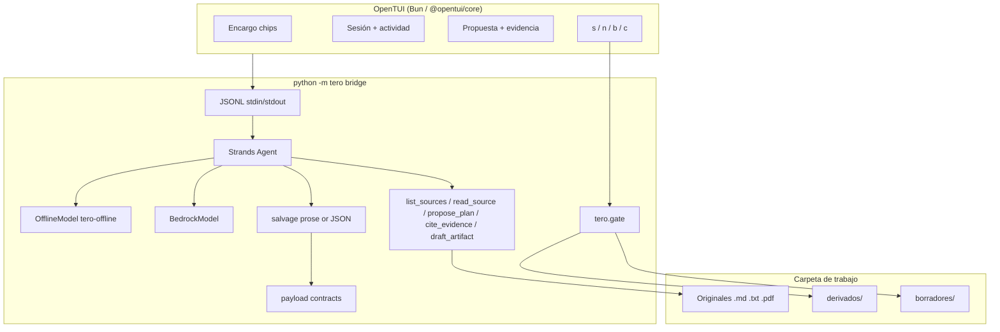

# Architecture — tero

tero is a **Strands agent** plus an **OpenTUI** shell. The agent prepares;
the teacher decides. The only artifact writes are `derivados/` (accepted)
and `borradores/` (draft). Originals are hashed and never overwritten.

The public face of the repo is a **Terminal UI splash** with a live ASCII
wave, not a SaaS page. Photocopied paper is only for pages tero creates:
[site/](site/) → <https://marcorojasb.github.io/tero/>.

## Thesis

> your sources, your judgment / agent prepares, teacher decides

The teacher’s folder is the system of record. Tools only read. The host
applies `s` / `n` / `b` / `c`. Warnings never block `s`. See
[docs/PUERTA-Y-PR8.md](docs/PUERTA-Y-PR8.md).

## Components

## Loop

1. Encargo chips (curso / asignatura / OA / duración / tipo).
2. Agent **lists and reads** only inside the carpeta (path sandbox + hash index).
3. Optional **typed plan** — teacher approves / edits / cancels.
4. **Draft** + evidence citations. If the model writes prose instead of a
   tool call, the host **salvages** a typed draft. Payload JSON (or
   markdown fallback) fills the LaTeX template. Tool use is capped
   (`DRAFT_TOOL_BUDGET`). Activity emits **one start per tool call**, not
   per stream delta.
5. Warnings (OA mismatch, thin skeleton, missing rubric, paraphrase,
   unknown path) are **visible and non-blocking**.
6. Gate: `s` write `derivados/`, `n` discard, `b` write `borradores/`,
   `c` another agent pass (crítica under `.tero/criticas/`).
7. Re-hash originals after write. A change is a warning, never a rewrite
   of the source.

## Why this HITL shape

The first MVP on `main` used Strands `HumanInTheLoop` around a
`write_derived` tool. This tree keeps Strands for the **agent loop** and
moves the write to the **host** so the TUI can show plan, evidence, and
`c` (correct) without the model being able to dump a file mid-stream.
Both are real HITL; the host gate is the one OpenTUI drives.

A draft that blocked `s` on `thin_evidence` / `unknown_source` (PR #8)
was rejected: it made the host the teacher. Quality loops with Nova Lite,
MiniMax, GLM and Qwen showed usable fichas that almost always carry a
paraphrase warning. Those must still be acceptable with `s`.

## Trust boundaries

| Can the agent… | |
| --- | --- |
| Read files outside the work folder | No |
| Overwrite originals | No (`WriteGuardError`) |
| Write `derivados/` itself | No — only `tero.gate` after `s`/`b` |
| Invent a live Bedrock call in `--offline` | No — `tero-offline` is a scripted Strands `Model` |
| Cite a snippet that is not in the file | Allowed, but host marks it `verified: false` and warns |
| Block `s` because citations are thin | No — that is the teacher’s call |

Package layout: `src/tero` (canonical). The older `tero/` layout from
PR #1 is not used.
