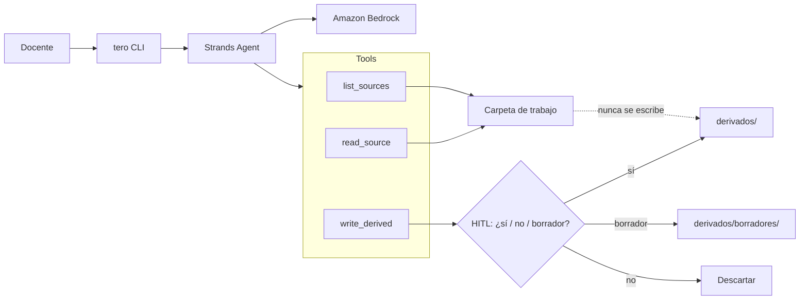

# tero

**tus fuentes, tu criterio — el agente prepara, el o la docente decide**
**your sources, your judgment / agent prepares, teacher decides**

tero is a command-line agent for **Chilean / Spanish-speaking teachers**. You point it at a work folder of *your* notes, curriculum snippets, and texts. It reads those sources, drafts a lesson plan or worksheet **with citations**, and **stops**. Nothing is written until you say yes. Originals are never overwritten.

Built with the [AWS Strands Agents SDK](https://strandsagents.com/) and [Amazon Bedrock](https://aws.amazon.com/bedrock/) for the **AWS Agents for Humans** hackathon (Devpost, Professional Agents track).

## Who it is for

Teachers in Chile (and other Spanish-speaking classrooms) who already keep a messy-but-precious folder: OA recortes, apuntes, a PDF, a student question. They want help *preparing*, not a bot that silently “applies” material into the official plan.

## Why it matters

Most school-facing AI tools generate fluent pages that are hard to audit. tero’s contract is the opposite:

1. **Sources stay yours.** The agent only reads a folder you choose.
2. **Judgment stays yours.** `write_derived` is gated by Strands **Human-in-the-Loop**. `s` / `n` / `b` (sí / no / borrador).
3. **Derivatives are obvious.** Approved artifacts land in `derivados/`. Drafts in `derivados/borradores/`. Originals are hashed before and after: if they change, tero treats that as a failure.

## Hackathon disclosure

The **product concept** (teacher-in-the-loop pedagogical preparation) is inspired by **Pteron**, a private Electron app by [Patagua](https://github.com/marcorojasb) / Marco Rojas. **This repository is a new project.** It does not copy Pteron’s Electron/SolidJS codebase. The agent here was implemented from scratch on Strands + Bedrock during the submission period, under the MIT license already in this repo.

## Architecture (short)



See [ARCHITECTURE.md](ARCHITECTURE.md) for the longer version.

## 20-minute judge path

You need Python **3.10+**. Two tracks:

| Track | Time | What it proves |
| --- | --- | --- |
| **A. Offline smoke** | ~2 min | Full Strands loop (tools + HITL + `derivados/`) with a scripted model. No AWS. |
| **B. Bedrock happy path** | ~15 min | Same loop with Amazon Nova Lite (or the model id you set). |

### A. Offline (no keys)

```bash
git clone https://github.com/marcorojasb/tero.git
cd tero
python3 -m venv .venv
source .venv/bin/activate   # Windows: .venv\Scripts\activate
pip install -e ".[dev]"
make demo-offline           # or: python -m tero demo --offline --yes
```

You should see the proposal printed, an automatic **sí**, a file under `fixtures/aula-5basico-agua/derivados/`, and the line **Originales intactos**.

To feel the gate yourself, drop `--yes` and type `s`, `n`, or `b`.

### B. Amazon Bedrock (free-tier friendly)

1. **AWS account** in a region where Amazon Nova is available. This README defaults to **`us-east-1`**.
2. **IAM permission** to invoke Bedrock (minimum):

```json
{
  "Version": "2012-10-17",
  "Statement": [
    {
      "Effect": "Allow",
      "Action": [
        "bedrock:InvokeModel",
        "bedrock:InvokeModelWithResponseStream"
      ],
      "Resource": [
        "arn:aws:bedrock:*::foundation-model/amazon.nova-lite-v1:0",
        "arn:aws:bedrock:*::foundation-model/amazon.nova-micro-v1:0",
        "arn:aws:bedrock:*::inference-profile/*"
      ]
    }
  ]
}
```

3. **Model access.** Amazon now auto-enables most serverless foundation models in-region. Confirm Nova Lite in the Bedrock **Chat / Text playground**. Anthropic models may still require a one-time usage form; tero defaults to **Amazon Nova Lite** to avoid that.

4. **Credentials** (any one of):

   - `aws configure` (recommended)
   - env vars `AWS_ACCESS_KEY_ID` / `AWS_SECRET_ACCESS_KEY` / optional `AWS_SESSION_TOKEN`
   - Bedrock API key: `AWS_BEARER_TOKEN_BEDROCK`

5. Copy env and run:

```bash
cp .env.example .env
# edit .env if your region / model differ
python -m tero demo --yes
```

Default model: `amazon.nova-lite-v1:0` via `TERO_MODEL_ID`. Nova Lite is inexpensive on-demand (and is the intended free-tier-friendly default). Switch to `amazon.nova-micro-v1:0` to spend even less, or to a Claude id if your account already has Anthropic enabled.

**Cost note:** a single demo is a handful of short tool-calling turns. Keep the fixture folder small. Do not commit `.env`.

### Your own folder

```bash
python -m tero run ./mi-unidad --task "Prepara una guía de 45 minutos sobre fracciones, 6° básico."
```

Accepted sources: `.md`, `.txt`, `.csv`, `.json`, `.pdf`. Writes only go to `derivados/`.

## CLI

```text
python -m tero demo [--offline] [--yes|--reject|--draft] [--task "..."]
python -m tero run FOLDER [--offline] [--yes|--reject|--draft] [--task "..."]
```

| Flag | Meaning |
| --- | --- |
| `--offline` | Strands agent + scripted model (CI / no AWS) |
| `--yes` | Auto-approve write to `derivados/` (demo) |
| `--reject` | Auto-reject — nothing is written |
| `--draft` | Auto-save under `derivados/borradores/` |
| `--quiet` | Hide model token stream |

Interactive answers: **`s`** sí, **`n`** no (default), **`b`** borrador.

## Tests (no secrets)

```bash
pip install -e ".[dev]"
pytest -q
```

CI runs the same suite. If Bedrock keys are absent, that is expected: the smoke test **mocks the model**, not the tools. The tools and the HITL gate are real.

## Repository layout

```text
tero/           Strands agent, tools, HITL ask, CLI
fixtures/       Sample Chilean 5° básico “agua” work folder
tests/          Workspace, approval, offline Strands loop
ARCHITECTURE.md
LICENSE         MIT (keep at repo root)
```

## License

MIT. See [LICENSE](LICENSE).
