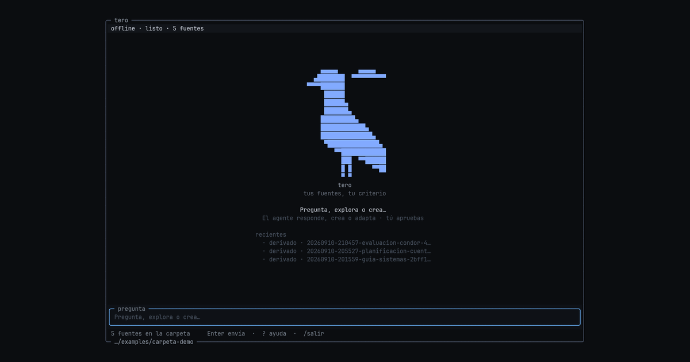

# tero

**tus fuentes, tu criterio — el agente propone, el o la docente decide**

```
╭─ tero ─────────────────────────────────╮
│ offline · conversación                 │
╰────────────────────────────────────────╯
      ▄▄▄▄▄      ▄▄▄▄▄
    ▄████████  ▀▀▀▀▀▀▀▀▀▀
  ▀▀▀▀███████              tero
       ██████              tus fuentes, tu criterio
       ██████▄
      ██████████▄
            █ █
            ▀ ▀
╭─ mensaje ──────────────────────────────╮
│ Pregunta, explora o crea…              │
╰────────────────────────────────────────╯
```

El chrome es la **TUI**. La persona escribe en lenguaje natural; tero
entiende la intención —responder, crear material o editar/adaptar lo que
ya existe— y **propone en memoria**. La hoja que tero crea —la fotocopia
que sale mañana a la sala— aparece solo cuando la persona aprueba. La
[página de GitHub](https://marcorojasb.github.io/tero/) es esa sesión,
en **una** ventana: conversación, avisos a la vista, aprobación.
Si el link da 404, enciende Pages una vez en
[Settings → Pages](https://github.com/marcorojasb/tero/settings/pages)
(Source **GitHub Actions**) y re-ejecuta el workflow `pages` — el token
de Actions no puede crear el sitio. Detalle: [docs/SITIO.md](docs/SITIO.md).
El modelo de la demo en el sitio es `tero-offline` (Strands scripted).
No finge Bedrock. AgentCore no es el producto.



Teacher agent for [Agents for Humans](https://agentsforhumans.devpost.com/): AWS
**Strands** behind a dense **OpenTUI** shell (same TUI family as
[OpenCode](https://opencode.ai)). Sibling *idea* of Pteron — your
sources, your judgment — without copying Pteron’s Electron/Solid/Meridian
desktop. Cheapest live path is **local Nova Lite**, not AgentCore
Runtime — [docs/AWS-GRATIS.md](docs/AWS-GRATIS.md). Submission pack:
[docs/hackathon/README.md](docs/hackathon/README.md).

Spanish UI. Keyboard-first. MIT.

```
mensaje → el agente entiende (responder | crear | editar/adaptar) → propuesta + vista previa → aprobación → derivados/
```

The model **never writes files**. It reads the folder and proposes in
memory; only the host writes, only after the person approves, only into
`derivados/`. Editing or adapting writes a **new** file and leaves the
origin untouched. Sources are hashed; tero refuses to overwrite them.
Warnings (`thin_evidence`, `unverified_citation`, OA raro) are visible
and **never block approval** — the teacher sees the cost and decides. See
[docs/PUERTA-Y-PR8.md](docs/PUERTA-Y-PR8.md) and the frozen protocol in
[docs/CONVERSACIONAL.md](docs/CONVERSACIONAL.md).

## 20-minute judge path

Python **3.10+**. Two tracks:

| Track | Time | What it proves |
| --- | --- | --- |
| **A. Offline** | ~2 min | Full Strands loop (tools + propuesta + evidencia + aprobación + `derivados/`) with a scripted model. No AWS. |
| **B. Bedrock** | ~15 min | Same loop with **Amazon Nova Lite** (`amazon.nova-lite-v1:0`). |

### A. Offline (no keys) — video path

```bash
git clone https://github.com/marcorojasb/tero.git
cd tero
python3 -m venv .venv && source .venv/bin/activate
pip install -e ".[dev]"
python -m tero demo --offline --yes
# or: make demo-offline
```

Uses a real `strands.Agent` plus a scripted `OfflineModel` labeled
**`tero-offline`** (not a fake Bedrock call). It reads
`examples/carpeta-demo/`, reads the sources, **proposes** a planificación
with evidence and a preview, approves it (`--yes`) and writes markdown
under `derivados/`. Originals stay hashed.

Interactive approval (drop `--yes`): tero muestra la propuesta y tú
respondes «sí», «no» o pides un cambio en lenguaje natural.

OpenTUI (needs [Bun](https://bun.sh)):

```bash
python -m tero tui --offline
```

**Home first:** queltehue ASCII, brand `tero`, one prompt line
*Pregunta, explora o crea…*. There is no menu of rumbos: escribe lo que
necesitas. Si a tero le falta un dato (curso, tema, OA, qué material
editar), **te lo pregunta**.

**Keys:** **`y`** aprueba (el host escribe en `derivados/`) · **`n`**
descarta · escribe tu respuesta en el hilo —«dale», «no, gracias»,
«mejor para 2° básico»— y el host la interpreta (`tero.approval`) ·
**`r`** reintentar error · **`?`** ayuda · **`[` `]`** evidencia ·
**Tab** paneles. Citas **✓** están en el archivo; **?** es paráfrasis.
`/export md|docx|latex` exporta el último material escrito.

### B. Amazon Bedrock (lean — Nova Lite only)

One Strands agent → Bedrock. **No** AgentCore Runtime/Gateway/Browser
as the product. Observability, if ever, is opt-in and does not move the
carpeta.

#### AWS free tier / Nova Lite checklist

1. Region with Amazon Nova on-demand (README default **`us-east-1`**).
2. **No Model access page** — AWS retired it. Serverless models (Nova Lite)
   auto-enable on first `InvokeModel` / Converse. Optional smoke: Bedrock
   **Model catalog** → playground with `amazon.nova-lite-v1:0`. If the
   account wants a cross-region profile, `TERO_MODEL=us.amazon.nova-lite-v1:0`.
3. IAM: `bedrock:InvokeModel` and `bedrock:InvokeModelWithResponseStream`
   on that model id (and `amazon.nova-micro-v1:0` only if you switch).
   Amazon Nova is not Marketplace; no `aws-marketplace:Subscribe` for Lite.
4. Credentials: `aws configure`, or `AWS_ACCESS_KEY_ID` /
   `AWS_SECRET_ACCESS_KEY`, or `AWS_BEARER_TOKEN_BEDROCK`. **Never commit
   `.env`.**
5. `cp .env.example .env` → set `TERO_OFFLINE=0` → fill keys:

```bash
python -m tero tui
# or
python -m tero demo --yes
```

Default model: `amazon.nova-lite-v1:0` via `TERO_MODEL` (alias
**`TERO_MODEL_ID`**). Nova Micro is cheaper for smokes. Other Bedrock
ids (GLM, MiniMax, Qwen) are the quality loop, not a hardcoded trio in
the host.

**Resilience (already in host):** Bedrock errors are humanized in Spanish
(auth / throttle / model / network). If the model returns tools/text
without a draft, tero **retries the draft once**, then **salvages**
prose/JSON into a typed proposal so you still have something to review. Curriculum OA
+ LaTeX stay **host-side** (catalog + templates). The model fills
**JSON**, not free-form TeX.

Video day: prefer `python -m tero demo --offline --yes` (honest
`tero-offline` label). Use Bedrock live only if keys + Nova access are
confirmed.

## What this is (and is not)

| In scope | Out of scope |
| --- | --- |
| Carpeta de trabajo as system of record | Electron desktop / TipTap / Meridian |
| Typed optional plan (objetivo, OA, duración, tipo) | Full Biblioteca UI |
| Artifact types: planificación, guía, evaluación, pauta/rúbrica, actividad | iPhone companion |
| Evidence panel (path + snippet + section) | SQLite session DB as product |
| Streaming activity (one event per tool call) | Ollama as default |
| Export `.md`, optional `.docx`, **LaTeX via JSON→plantilla** | Secrets in git |
| Catálogo OA Chile host-side (`list_oa` / `get_oa`) | Currículum oficial MINEDUC completo |
| Warnings visible before approval, never blocking | Magic `forzar` to override the teacher |

Ollama / local LLMs can come later; they are not the default.

## Architecture

```
┌─ OpenTUI (Bun, @opentui/core) ─────────────┐
│  home · conversación · actividad           │
│  propuesta: qué hará + vista previa        │
│  evidencia ✓/? · avisos · aprobación y/n   │
└─────────────── JSONL stdin/stdout ─────────┘
                    │
┌─ python -m tero bridge  (Strands Agent) ───┐
│  tools: list/search/read (sandbox)         │
│         list_artifacts/read_artifact       │
│         list_oa/get_oa/search_oa (catálogo)│
│         cite_evidence, proponer_crear,     │
│         proponer_editar  (en memoria)      │
│  host: hash check, salvage, coerce payload │
│         warnings, aprobación, write        │
│         export md|docx|latex (templates)   │
└────────────────────────────────────────────┘
                    │
         carpeta originales  (read-only, hashed)
         carpeta/derivados   (aprobado)
         carpeta/borradores  (legado)
```

HITL is structural: `proponer_crear` / `proponer_editar` are
**in-memory**. Only the host writes files, and only after the person
approves a proposal they saw.

See [ARCHITECTURE.md](ARCHITECTURE.md). Docs index:
[docs/README.md](docs/README.md). Adversarial self-critique:
[docs/ANALISIS-ADVERSARIAL.md](docs/ANALISIS-ADVERSARIAL.md). LaTeX +
currículo: [docs/ADVERSARIAL-LATEX-CURRICULO.md](docs/ADVERSARIAL-LATEX-CURRICULO.md).
Por qué los avisos no bloquean la aprobación:
[docs/PUERTA-Y-PR8.md](docs/PUERTA-Y-PR8.md). Ficha landing:
[docs/SITIO.md](docs/SITIO.md).

## Contexto del encargo + OA de catálogo

El contexto (curso, asignatura, OA, duración, tipo preferido) es
**contexto**, no un formulario que haya que llenar antes de conversar:

```bash
python -m tero tui --offline --curso "4° básico" --oa "LEN-4B-OA04" --duracion "45 min" --tipo planificacion
```

TUI: `/curso 4° básico` · `/asignatura Lenguaje` carga OA reales del
catálogo · `/oa LEN-4B-OA04` (valida) · `/tipo guia` · `/export latex`.
Cambiar el contexto no reinicia nada: el agente lo usa en el próximo
mensaje.

Catálogo mínimo (4°–6° Lenguaje/Matemática/Ciencias): `curriculum/chile/`
— **no** es texto oficial MINEDUC verbatim. Lineamientos de evaluación
(resumen de aula): `curriculum/chile/evaluacion/lineamientos.md`.

## Export LaTeX (JSON → plantilla)

Nova Lite (y el offline) **no** emiten TeX libre. El host rellena
plantillas en `templates/latex/` desde un JSON schema (o desde el
markdown de la propuesta):

```bash
# tras aprobar la propuesta:
python -m tero export --format latex path/al/artefacto.md
# o payload schema directo (smoke Nova Lite-safe):
python -m tero export --format latex --payload guia.json --out /tmp/guia.tex /tmp/noop.md
```

PDF opcional si hay `latexmk` (`--pdf` / sin shell-escape). Si no, queda
el `.tex`.

Extra classroom pack from the first MVP (agua / 5° básico, includes a
PDF): `fixtures/aula-5basico-agua/`.

```bash
python -m tero demo --offline --yes --carpeta fixtures/aula-5basico-agua
```

## Tests

```bash
pytest
ruff check src tests && ruff format --check src tests
cd tui && bun install && bun test src
```

## Hackathon disclosure

This public MIT repo is a **new project** (tero), built for Agents for
Humans. The *product concept* (teacher-in-the-loop pedagogical
preparation) is inspired by **Pteron**, a private Electron app by Marco
Rojas / Patagua. It does **not** copy that Electron/SolidJS codebase.
Offline demo is scripted on purpose so the video does not pretend to be
a live Bedrock call.

See [docs/NORMAS.md](docs/NORMAS.md), [AGENTS.md](AGENTS.md),
[CONTRIBUTING.md](CONTRIBUTING.md).
